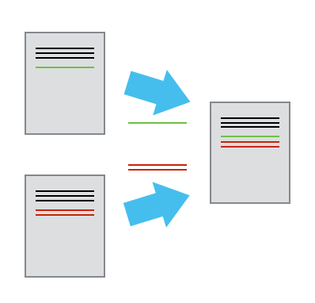
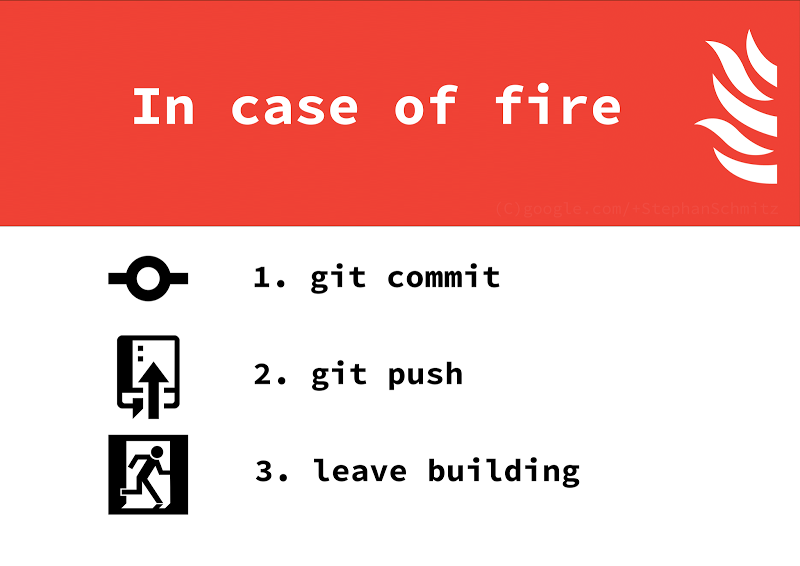
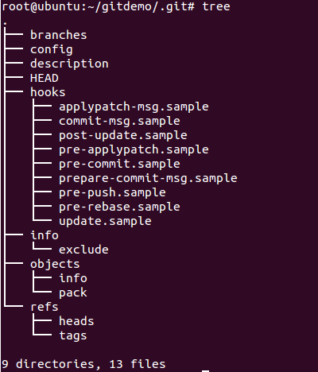
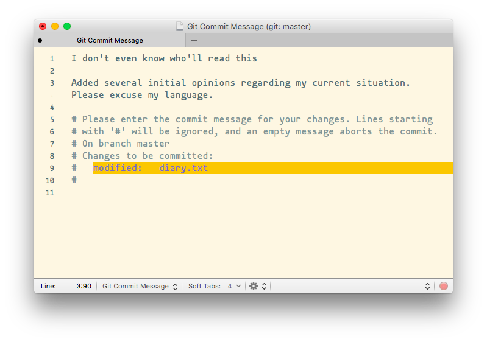
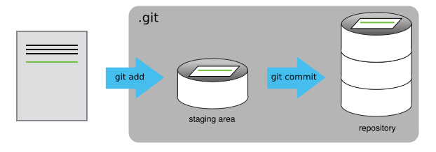
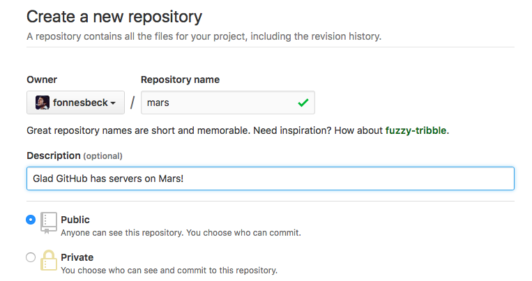
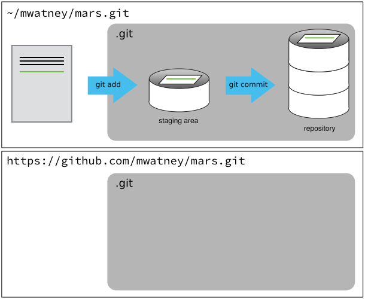
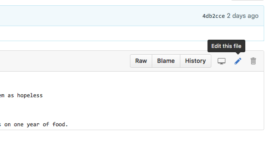
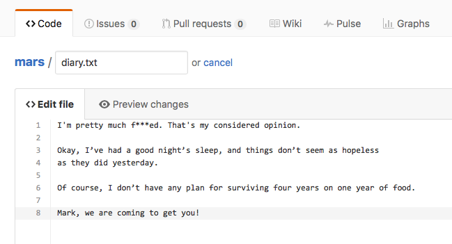
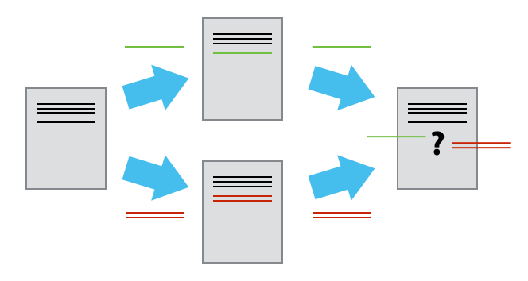

autoscale: true
build-lists: true
theme: Letters from Sweden, 4

# Automated Version Control with Git

Chris Fonnesbeck  
**VUMC Biostatistics**


---

> What is version control and why should I use it?

^ VCS is like an "unlimited undo", and allows many people to work in parallel
We'll start by exploring how version control can be used to keep track of what one person did and when. 
Even if you aren't collaborating with other people, automated version control is important

---

# Objectives

1. Understand the benefits of an automated version control system.  

2. Understand the basics of how Git works.


---

Changes are saved sequentially


^ Version control systems start with a base version of the document and
then save just the changes you made at each step of the way. You can
think of it as a tape: if you rewind the tape and start at the base
document, then you can play back each change and end up with your
latest version.

---

Different Versions Can be Saved


^ Once you think of changes as separate from the document itself, you
can then think about "playing back" different sets of changes onto the
base document and getting different versions of the document. For
example, two users can make independent sets of changes based on the
same document.

---

Multiple Versions Can be Merged



^ If there aren't conflicts, you can even play two sets of changes onto the same base document.

---

# VCS


^ A version control system is a tool that keeps track of these changes for us and
helps us version and merge our files.

---

# Commit



^ It allows you to
decide which changes make up the next version, called a **commit**, and keeps useful metadata about them. 

---

# Repository



^ The complete history of commits for a particular project and their metadata make up
a **repository**. Repositories can be kept in sync
across different computers facilitating collaboration among different people.

---

# The History of Version Control Systems

- RCS
- CVS
- Subversion
- **Git**
- **Mercurial**

^ Automated VCS have been around since the early 1980s, used by many large companies.
Older VCS have various limitations in their capabilities.
More modern systems, such as Git and Mercurial are *distributed*; they do not need a centralized server to host the repository
also include powerful merging tools that make it possible for multiple authors to work within the same files concurrently.

---

## **Example** Paper Writing

- Imagine you drafted an excellent paragraph for a paper you are writing, but later *ruin* it. How would you retrieve the *excellent* version of your paragraph? Is it even possible?

- Imagine you have *5 co-authors*. How would you manage the changes and comments they make to your paper? 

^ If you use Microsoft Word, what happens if you accept changes made using the
    `Track Changes` option? Do you have a history of those changes?
    
---

> How do I get set up to use Git?

---

When we use Git on a new computer for the first time,
we need to configure a few things. 

*   specify our **name** and **email address**,
*   **colorize** our output,
*   identify our preferred **text editor**,
*   apply settings **globally** (or not).

---

# Configuration commands


```bash
$ git config --global user.name "Mark Watney"
$ git config --global user.email "mwatney@nasa.gov"
$ git config --global color.ui "auto"
```

^ On a command line, Git commands written as `git verb`,
where `verb` is what we actually want to do.
User name and email will be associated with your Git activity.
These only need to be run once: the flag `--global` tells Git
to use the settings for every project, in your user account, on this computer.

---

Text editor configurations

* **Atom**: 
    `$ git config --global core.editor "atom --wait"`

* **TextMate**
    `$ git config --global core.editor "mate -w"`

* **Notepad++ (Windows)**
    `$ git config --global core.editor "'c:/program files/Notepad++/notepad++.exe' -multiInst -notabbar -nosession -noPlugin"`

^Git requires the editor to wait and report a return value: it gives the editor an opportunity to **abort** the commit if something goes wrong; it gives us an opportunity to save the commit message **several times** before deciding we're finished. 

---

## Proxy

^ In some networks you need to use a proxy server. If this is the case, you
may also need to tell Git about the proxy:

```bash
$ git config --global http.proxy proxy-url
$ git config --global https.proxy proxy-url
```

To disable the proxy, use

```bash
$ git config --global --unset http.proxy
$ git config --global --unset https.proxy
```

---


# Check your settings

```bash
$ git config --list
```

```
user.name=Chris Fonnesbeck
user.email=chris.fonnesbeck@vanderbilt.edu
github.user=fonnesbeck
github.password=password123
push.default=simple
diff.tool=Kaleidoscope
mergetool.prompt=false
merge.tool=Kaleidoscope
```

^ You can change your configuration as many times as you want: just use the
same commands to choose another editor or update your email address.

---

## Git Help and Manual

```
$ git config -h
$ git config --help
```

---

# Creating repositories

^ Where does Git store information

^ We will create a local repository

---

Create a project directory ...


```bash
$ mkdir escape_mars
$ cd escape_mars
```

---

Create a project directory ...


```bash
$ mkdir escape_mars
$ cd escape_mars
```

... then initialize a **repository** called `escape_mars`.

```bash
$ git init
```

^ the repository is where Git can store versions of our files

---

# What's inside?

^ If we use `ls` to show the directory's contents,
it appears that nothing has changed:

```bash
$ ls
```

---

# What's inside?

```bash
$ ls
```

But if we add the `-a` flag to show everything ...

^ we can see that Git has created a hidden directory within `escape_mars` called `.git`:

```bash
$ ls -a
```

```
.	..	.git
```


^ Git stores information about the project in this special sub-directory.
If we ever delete it,
we will lose the project's history.

---

# Project status

^ We can check that everything is set up correctly
by asking Git to tell us the status of our project:

```bash
$ git status
```

```
# On branch master
#
# Initial commit
#
nothing to commit (create/copy files and use "git add" to track)
```

---

## Places to Create Git Repositories


^ Mark Watney starts a new project, `potatoes`. He enters the following sequence of commands to create one Git repository inside another:

Consider the following sequence of commands:

```bash
cd                  # return to home directory
mkdir escape_mars   # make a new directory escape_mars
cd escape_mars      # go into escape_mars
git init            # make the escape_mars directory a Git repository
mkdir potatoes      # make a sub-directory escape_mars/potatoes
cd potatoes         # go into escape_mars/potatoes
git init            # make the potatoes sub-directory a Git repository
```

* **Why is it a bad idea to do this?**
* **How can Mark Watney undo his last `git init`?**

---

# Tracking Changes

- "How do I record changes in Git?"
- "How do I record notes about what changes I made and why?"


^ 1. Go through the modify-add-commit cycle for one or more files.
2. Explain where information is stored at each stage of Git commit workflow.

---

Let's create a file called `diary.txt` 


```bash
$ mate diary.txt
```

Then, type some text into the `diary.txt` file...

---


^ How can we check the contents of the file, without opening it?

---


```bash
$ cat diary.txt
```

```
I'm pretty much f***ed. That's my considered opinion.
```

---

# Check status

^ If we check the status of our project again,
Git tells us that it's noticed the new file:

```bash
$ git status
```

```
# On branch master
#
# Initial commit
#
# Untracked files:
#   (use "git add <file>..." to include in what will be committed)
#
#	diary.txt
nothing added to commit but untracked files present (use "git add" to track)
```


^ The "untracked files" message means that there's a file in the directory
that Git isn't keeping track of.
We can tell Git to track a file using `git add`:

---

# Adding files

```bash
$ git add diary.txt
```

and then check that the right thing happened ...

---

```bash
$ git status
```

```
# On branch master
#
# Initial commit
#
# Changes to be committed:
#   (use "git rm --cached <file>..." to unstage)
#
#	new file:   diary.txt
#
```

^ Git now knows that it's supposed to keep track of `diary.txt`,
but it hasn't recorded these changes as a commit yet.

---

# Committing changes

```bash
$ git commit -m "I don't even know who'll read this"
```

```
[master (root-commit) 643a892] I don't even know who'll read this
 1 file changed, 1 insertion(+)
 create mode 100644 diary.txt
```

^ Git takes everything we have told it to save by using `git add`
and stores a copy permanently inside the special `.git` directory.

^This permanent copy is called a **commit** and its short identifier is `643a892`

^ If we just run `git commit` without the `-m` option,
Git will launch the default text editor (`core.editor`)

---

# Good commit messages

* start with a brief (<50 characters) summary of changes made in the commit.
* additional notes may follow a blank line after the summary



---

If we run `git status` now:

```bash
$ git status
```

```
# On branch master
nothing to commit, working directory clean
```


^ it tells us everything is up to date.

---

# Project history

```bash
$ git log
```

```
commit 643a89258344ec9a02ab8e85e1493945a9b71079
Author: Mark Watney <mwatney@nasa.gov>
Date:   Sun Aug 14 14:53:07 2016 -0700

    I don't even know who'll read this

```

^ `git log` lists all commits  made to a repository in reverse chronological order.
The listing for each commit includes the commit's full identifier (which starts with the same characters as the short identifier printed by the `git commit` command earlier), the commit's author, when it was created,and the log message Git was given when the commit was created.

---

## Where Are My Changes?

Have a look at the contents of your project directory now:

```bash
$ ls
```

---

## Where Are My Changes?

Have a look at the contents of your project directory now:

```bash
$ ls
```

```
diary.txt
```

---

```bash
$ ls .git
```

```
COMMIT_EDITMSG config         hooks          info           objects
HEAD           description    index          logs           refs
```

Git saves information about files' history in the special `.git` directory mentioned earlier so that our filesystem doesn't become cluttered.

^(and so that we can't accidentally edit or delete an old version).

---

Suppose Mark Watney adds more information to the file:


```bash
$ mate diary.txt
```

```
I'm pretty much f***ed. That's my considered opinion.

Okay, I’ve had a good night’s sleep, and things don’t seem as hopeless 
as they did yesterday.
```

---

When we run `git status` now...

```bash
$ git status
```

---

When we run `git status` now...

```bash
$ git status
```

...it tells us that a file it already knows about has been **modified**:

```
On branch master
Changes not staged for commit:
  (use "git add <file>..." to update what will be committed)
  (use "git checkout -- <file>..." to discard changes in working directory)

	modified:   diary.txt

no changes added to commit (use "git add" and/or "git commit -a")
```


^ The last line is the key phrase:
"no changes added to commit".
We have changed this file,
but we haven't told Git we will want to save those changes
(which we do with `git add`)
nor have we saved them (which we do with `git commit`).

---

# Reviewing changes

^ It is good practice to always review our changes before saving them. We do this using `git diff`. This shows us the differences between the current state of the file and the most recently saved version:

```bash
$ git diff
```

```diff
diff --git a/diary.txt b/diary.txt
index 218b2e6..1004f7e 100644
--- a/diary.txt
+++ b/diary.txt
@@ -1 +1,4 @@
 I'm pretty much f***ed. That's my considered opinion.
+
+Okay, I’ve had a good night’s sleep, and things don’t seem as hopeless 
+as they did yesterday.
```

^ The output is cryptic because
it is actually a series of commands for tools like editors and `patch`
telling them how to reconstruct one file given the other.

---

``` [.highlight: 1]
diff --git a/diary.txt b/diary.txt 
index 218b2e6..1004f7e 100644
--- a/diary.txt
+++ b/diary.txt
@@ -1 +1,4 @@
 I'm pretty much f***ed. That's my considered opinion.
+
+Okay, I’ve had a good night’s sleep, and things don’t seem as hopeless 
+as they did yesterday.

```

The *first* line tells us that Git is producing output similar to the Unix `diff` command, comparing the old and new versions of the file.

​
 ---


``` [.highlight: 2]
diff --git a/diary.txt b/diary.txt
index 218b2e6..1004f7e 100644  
--- a/diary.txt
+++ b/diary.txt
@@ -1 +1,4 @@
 I'm pretty much f***ed. That's my considered opinion.
+
+Okay, I’ve had a good night’s sleep, and things don’t seem as hopeless 
+as they did yesterday.
```

The *second* line tells exactly which **versions** of the file Git is comparing.

**218b2e6** and **1004f7e** are unique labels for those versions.
​    
 ---

``` [.highlight: 3,4]
diff --git a/diary.txt b/diary.txt
index 218b2e6..1004f7e 100644
--- a/diary.txt  
+++ b/diary.txt  
@@ -1 +1,4 @@
 I'm pretty much f***ed. That's my considered opinion.
+
+Okay, I’ve had a good night’s sleep, and things don’t seem as hopeless 
+as they did yesterday.
```

The *third* and *fourth* lines are a legend for symbols used to indicate each file.

---

``` [.highlight: 5-9]
diff --git a/diary.txt b/diary.txt
index 218b2e6..1004f7e 100644
--- a/diary.txt
+++ b/diary.txt
@@ -1 +1,4 @@  
 I'm pretty much f***ed. That's my considered opinion.
+
+Okay, I’ve had a good night’s sleep, and things don’t seem as hopeless 
+as they did yesterday.  
```

The remaining lines  show us the actual differences and the lines on which they occur.

---

# Committing changes

^ After reviewing our change, it's time to commit it:

```bash
$ git commit -m 'Added commentary of second day on Mars'
```

---

# Committing changes

^ After reviewing our change, it's time to commit it:

```bash
$ git commit -m 'Added commentary of second day on Mars'
```

```
On branch master
Changes not staged for commit:
	modified:   diary.txt

no changes added to commit
```


^ Whoops:
Git won't commit because we didn't use `git add` first.

---

```bash
$ git add diary.txt
$ git commit -m 'Added commentary of second day on Mars'
```

```
[master c816814] Added commentary of second day on Mars
 1 file changed, 3 insertions(+)
```

^ add files to the set we want to commit before actually committing anything. 
Allows us to commit our changes in **stages** and capture changes in logical portions rather than only large batches.

^ e.g., suppose we're adding a few citations to to our thesis.
We might want to commit those additions, and the corresponding addition to the bibliography, but *not* commit the work we're doing on the conclusion
WHY?

---

## Staging Area

^ To allow for this, Git has a special *staging area*
Keeps track of things that have been added to the current **change set** but not yet committed.



^ think of Git as taking snapshots of changes; 
`git add` specifies *what* will go in a snapshot and `git commit` then *actually takes* the snapshot, and makes a permanent record of it

---

# Adding and committing

All in one step:

```bash
$ git commit -a
```

^ BUT, it's almost always better to
explicitly add things to the staging area, because you might
commit changes you forgot you made.

---

# Add another line

^ Let's watch as our changes to a file move from our editor
to the staging area
and into long-term storage.


```bash
$ mate diary.txt
```


```
I'm pretty much f***ed. That's my considered opinion.

Okay, I’ve had a good night’s sleep, and things don’t seem 
as hopeless as they did yesterday.

Of course, I don’t have any plan for surviving four years on one 
year of food.

```

---

```bash
$ git diff
```

```diff
diff --git a/diary.txt b/diary.txt
index 1004f7e..b79ef50 100644
--- a/diary.txt
+++ b/diary.txt
@@ -2,3 +2,6 @@ I'm pretty much f***ed. That's my considered opinion.
 
 Okay, I’ve had a good night’s sleep, and things don’t seem 
 as hopeless as they did yesterday.
+
+Of course, I don’t have any plan for surviving four years on one 
+year of food.
```

^ So far, so good:
we've added one line to the end of the file
(shown with a `+` in the first column).

---

^ Now let's put that change in the staging area
and see what `git diff` reports:

```bash
$ git add diary.txt
```

---

^ Now let's put that change in the staging area
and see what `git diff` reports:

```bash
$ git add diary.txt
$ git diff
```

^ There is no output:
as far as Git can tell,
there's no difference between what it's been asked to save permanently
and what's currently in the directory.

---

# Diffing with staged changes

```bash
$ git diff --staged
```

```diff
index 1004f7e..b79ef50 100644
--- a/diary.txt
+++ b/diary.txt
@@ -2,3 +2,5 @@ I'm pretty much f***ed. That's my considered opinion.
 
 Okay, I’ve had a good night’s sleep, and things don’t seem as hopeless 
 as they did yesterday.
+
+Of course, I don’t have any plan for surviving four years on one year of food.
```

^ shows us the difference between the last committed change and what's in the staging area.

---

```bash
$ git commit -m "Added evaluation of provisions"
```

```
[master 4db2cce] Added evaluation of provisions
 1 file changed, 2 insertions(+)
```

---

```bash
$ git commit -m "Added evaluation of provisions"
```

```
[master 4db2cce] Added evaluation of provisions
 1 file changed, 2 insertions(+)
```

check our status ...

```bash
$ git status
```

```
# On branch master
nothing to commit, working directory clean
```

---

# Check the log

^and look at the history of what we've done so far:

```bash
$ git log
```

```
commit 4db2cce13e52ee653cdabcc7a52c5a6b3b7cb2b3
Author: Mark Watney <mwatney@nasa.gov>
Date:   Sun Aug 14 15:00:30 2016 -0700

    Added evaluation of provisions

commit c81681408c0b6b4b69ecf5e3ca4413863c8bbb73
Author: Mark Watney <mwatney@nasa.gov>
Date:   Sun Aug 14 14:57:45 2016 -0700

    Added commentary of second day on Mars

commit 643a89258344ec9a02ab8e85e1493945a9b71079
Author: Mark Watney <mwatney@nasa.gov>
Date:   Sun Aug 14 14:53:07 2016 -0700

    I don't even know who'll read this

```

---

# Paging the Log

When the output of `git log` is too long to fit in your screen, `git` uses a **pager** to split it into pages of the size of your screen.

^When this "pager" is called, you will notice that the last line in your
screen is a `:`, instead of your usual prompt.

*   To get out of the pager, press *q*.
*   To move to the next page, press the *space bar*.
*   To search for **some_word** in all pages, type 
    `/some_word`
    and navigate through matches pressing *n*.

---

^ To recap, when we want to add changes to our repository,
we first need to add the changed files to the staging area
(`git add`) and then commit the staged changes to the
repository (`git commit`):


---

## Choosing a Commit Message

Which of the following commit messages would be most appropriate for the last commit made to `diary.txt`?

1. "Changes"
2. "Added line 'Of course, I don’t have any plan for surviving four years on one year of food.' to diary.txt"
3. "Added evaluation of provisions"

^Answer 1 is not descriptive enough,
and answer 2 is too descriptive and redundant,
but answer 3 is good: short but descriptive.

---

## Committing Changes to Git

Which command(s) below would save the changes of **myfile.txt** to my local Git repository?

1. `$ git commit -m "my recent changes"`

2. `$ git init myfile.txt`  
   `$ git commit -m "my recent changes"`

3. `$ git add myfile.txt`  
   `$ git commit -m "my recent changes"`

4. `$ git commit -m myfile.txt "my recent changes"`

^1. Would only create a commit if files have already been staged.
2. Would try to create a new repository.
3. Is correct: first add the file to the staging area, then commit.
4. Would try to commit a file "my recent changes" with the message myfile.txt.

---

## Committing Multiple Files

The staging area can hold changes from *any number* of files that you want to commit as a *single snapshot*.

1. Add some text to **diary.txt** noting your decision to reconfigure the mars rover
2. Create a new file **rover.txt** with your initial thoughts on reconfiguring the rover
3. Add changes from both files to the staging area, and commit those changes.

---

# Exploring History

^- "How can I identify old versions of files?"
- "How do I review my changes?"
- "How can I recover old versions of files?"


---

# HEAD

^ As we saw in the previous lesson, we can refer to commits by their
identifiers.  

You can refer to the _most recent commit_ of the working directory by using the identifier `HEAD`.

---

^ We've been adding one line at a time to `diary.txt`, so it's easy to track our
progress by looking, so let's do that using our `HEAD`s.  Before we start,
let's make a change to `diary.txt`.


```bash
$ mate diary.txt
```

```
I'm pretty much f***ed. That's my considered opinion.

Okay, I’ve had a good night’s sleep, and things don’t seem 
as hopeless as they did yesterday.

Of course, I don’t have any plan for surviving four years on 
one year of food.

For now, I’m well fed and have a purpose: Fix the damn radio.

```

---

# Diffing with HEAD

```bash
$ git diff HEAD diary.txt
```

```diff
diff --git a/diary.txt b/diary.txt
index b79ef50..e2287f6 100644
--- a/diary.txt
+++ b/diary.txt
@@ -4,3 +4,5 @@ Okay, I’ve had a good night’s sleep, and things don’t seem as hopeless
 as they did yesterday.
 
 Of course, I don’t have any plan for surviving four years on one year of food.
+
+For now, I’m well fed and have a purpose: Fix the damn radio.
```

^ which is the same as what you would get if you leave out `HEAD` (try it).

---

# Diffing with HEAD


^  you can refer to previous commits.  We do that by adding `~1` to refer to the commit one before `HEAD`.

```bash
$ git diff HEAD~1 diary.txt
```

```diff
diff --git a/diary.txt b/diary.txt
index 1004f7e..e2287f6 100644
--- a/diary.txt
+++ b/diary.txt
@@ -2,3 +2,7 @@ I'm pretty much f***ed. That's my considered opinion.
 
 Okay, I’ve had a good night’s sleep, and things don’t seem as hopeless 
 as they did yesterday.
+
+Of course, I don’t have any plan for surviving four years on one year of food.
+
+For now, I’m well fed and have a purpose: Fix the damn radio.
```

---

# Comparing with previous commits

^ If we want to see what we changed at different steps, we can use `HEAD~1`, `HEAD~2`, and so on, to refer to old commits:


```bash
$ git diff HEAD~2 diary.txt
```

```diff
diff --git a/diary.txt b/diary.txt
index 218b2e6..e2287f6 100644
--- a/diary.txt
+++ b/diary.txt
@@ -1 +1,8 @@
 I'm pretty much f***ed. That's my considered opinion.
+
+Okay, I’ve had a good night’s sleep, and things don’t seem as hopeless 
+as they did yesterday.
+
+Of course, I don’t have any plan for surviving four years on one year of food.
+
+For now, I’m well fed and have a purpose: Fix the damn radio.
```


^ In this way, we can build up a chain of commits.

^`HEAD~123` goes back 123 commits.

---

# Diffing by hash

^ We can also refer to commits using those long strings of digits and letters

^ every change to any set of files on any computer has a unique 40-character identifier.

```bash
$ git diff c81681408c0b6b4b69ecf5e3ca4413863c8bbb73 diary.txt
```

```diff
diff --git a/diary.txt b/diary.txt
index 1004f7e..e2287f6 100644
--- a/diary.txt
+++ b/diary.txt
@@ -2,3 +2,7 @@ I'm pretty much f***ed. That's my considered opinion.
 
 Okay, I’ve had a good night’s sleep, and things don’t seem as hopeless 
 as they did yesterday.
+
+Of course, I don’t have any plan for surviving four years on one year of food.
+
+For now, I’m well fed and have a purpose: Fix the damn radio.
```


^ but typing out random 40-character strings is annoying,
so Git lets us use just the first few characters

---

```bash
$ git diff c816 diary.txt
```

```diff
diff --git a/diary.txt b/diary.txt
index 1004f7e..e2287f6 100644
--- a/diary.txt
+++ b/diary.txt
@@ -2,3 +2,7 @@ I'm pretty much f***ed. That's my considered opinion.
 
 Okay, I’ve had a good night’s sleep, and things don’t seem as hopeless 
 as they did yesterday.
+
+Of course, I don’t have any plan for surviving four years on one year of food.
+
+For now, I’m well fed and have a purpose: Fix the damn radio.
```

^
a large project might have 1000 active developers who commit 10 commits per day. 
In these circumstances, it would take approximately 4×10^17 years for a collision 
to happen with 50% probability.

---

# Bad things happen

^now how can we restore older versions of things?


Let's suppose we accidentally overwrite our file:

```bash
$ mate diary.txt
```

```
So I ran into a bunch of problems with my water plan.
```

---

`git status` now tells us that the file has been changed ...

```bash
$ git status
```

```
# On branch master
# Changes not staged for commit:
#   (use "git add <file>..." to update what will be committed)
#   (use "git checkout -- <file>..." to discard changes in working directory)
#
#	modified:   diary.txt
#
no changes added to commit (use "git add" and/or "git commit -a")
```

... but those changes haven't been staged

---

# Reverting to HEAD


^We can put things back the way they were
by using `git checkout`:

```bash
$ git checkout HEAD diary.txt
$ cat diary.txt
```

```
I'm pretty much f***ed. That's my considered opinion.

Okay, I’ve had a good night’s sleep, and things don’t seem as hopeless 
as they did yesterday.

Of course, I don’t have any plan for surviving four years on one year of food.
```


^ `git checkout` checks out (i.e., restores) an old version of a file.
In this case,
we're telling Git that we want to recover the version of the file recorded in `HEAD`,
which is the last saved commit.

---

If we want to go back even further,
we can use a commit identifier instead:

```bash
$ git checkout c816814 diary.txt
```

---

## Don't Lose Your HEAD

Notice we used

```bash
$ git checkout c816814 diary.txt
```

to revert **diary.txt** to its state after the commit *c816814*.

If you forget **diary.txt** in that command, git will tell you that 

> You are in 'detached HEAD' state.

^ In this state, you shouldn't make any changes.
You can fix this by reattaching your head using ``git checkout master``

---

^ we must use the commit number that identifies the state of the repository
*before* the change we're trying to undo.

^ A common mistake is to use the number of
the commit in which we made the change we're trying to *get rid of*.

^ Here, we want to retrieve the state from before the most
recent commit, which is commit `f22b25e`:


---

## Simplifying the Common Case

If you read the output of `git status` carefully, you'll see that it includes this hint:

```bash
(use "git checkout -- <file>..." to discard changes in working directory)
```

^ As it says,
`git checkout` without a version identifier restores files to the state saved in `HEAD`.

The double dash `--` is needed to separate the names of the files being recovered from the command itself.

^ without it,
Git would try to use the name of the file as the commit identifier.

---

## Recovering Older Versions of a File

Jennifer has made changes to the Python script that she has been working on for weeks, and the modifications she made this morning "broke" the script and it no longer runs. 

Luckily, she has been keeping track of her project's versions using Git! Which commands below will let her recover the last committed version of her Python script called **data_cruncher.py**?

1. `$ git checkout HEAD`

2. `$ git checkout HEAD data_cruncher.py`

3. `$ git checkout HEAD~1 data_cruncher.py`

4. `$ git checkout <unique ID of last commit> data_cruncher.py`

^ Both 2 and 4

---


## Explore and Summarize Histories

^ Exploring history is an important part of git, often it is a challenge to find the right commit ID, especially if the commit is from several months ago.

After several months, the *escape_mars* project has more than 50 files.

You would like to find a commit with specific text in *diary.txt* is modified.

When you type **git log**, a very long list appeared,

**How can you narrow down the search?**

---

## Explore and Summarize Histories

^ Recall that the `git diff` command allow us to explore one specific file,
e.g. `git diff diary.txt`. We can apply the similar idea here.

```bash
$ git log diary.txt
```

Perhaps some of these commit messages are very ambiguous (e.g. "update files").

**How can you search through these files?**

---

## Explore and Summarize Histories

Both `git diff` and `git log` are very useful and they summarize different part of the history for you.

Is that possible to combine both? Let's try the following:

```bash
$ git log --patch diary.txt
```

^ You should get a long list of output, and you should be able to see both commit messages and the difference between each commit.

---

```
commit 4db2cce13e52ee653cdabcc7a52c5a6b3b7cb2b3
Author: Chris Fonnesbeck <chris.fonnesbeck@vanderbilt.edu>
Date:   Sun Aug 14 15:00:30 2016 -0700

    Added evaluation of provisions

diff --git a/diary.txt b/diary.txt
index 1004f7e..b79ef50 100644
--- a/diary.txt
+++ b/diary.txt
@@ -2,3 +2,5 @@ I'm pretty much f***ed. That's my considered opinion.
 
 Okay, I’ve had a good night’s sleep, and things don’t seem 
 as hopeless as they did yesterday.
+
+Of course, I don’t have any plan for surviving four years on 
+one year of food.
```

---

```
commit c81681408c0b6b4b69ecf5e3ca4413863c8bbb73
Author: Chris Fonnesbeck <chris.fonnesbeck@vanderbilt.edu>
Date:   Sun Aug 14 14:57:45 2016 -0700

    Added commentary of second day on Mars

diff --git a/diary.txt b/diary.txt
index 218b2e6..1004f7e 100644
--- a/diary.txt
+++ b/diary.txt
@@ -1 +1,4 @@
 I'm pretty much f***ed. That's my considered opinion.
+
+Okay, I’ve had a good night’s sleep, and things don’t seem 
+as hopeless as they did yesterday.

```

---


# Ignoring Things

^ "How can I tell Git to ignore files I don't want to track?"
objectives:
- "Configure Git to ignore specific files."
- "Explain why ignoring files can be useful."


---

# Intermediate output files

^ What if we have files that we do not want Git to track for us,
like backup files created by our editor
or intermediate files created during data analysis.
Let's create a few dummy files:

```bash
$ mkdir potato_results
$ touch a.dat b.dat c.dat potato_results/a.out 
  potato_results/b.out
$ git status
```

---

# Intermediate output files

^ What if we have files that we do not want Git to track for us,
like backup files created by our editor
or intermediate files created during data analysis.
Let's create a few dummy files:

```bash
$ mkdir potato_results
$ touch a.dat b.dat c.dat potato_results/a.out 
  potato_results/b.out
$ git status
```

```
On branch master
Untracked files:
  (use "git add <file>..." to include in what will be committed)

	a.dat
	b.dat
	c.dat
	potato_results/

nothing added to commit but untracked files present (use "git add" to track)

```


^ Putting these files under version control would be a waste of disk space.
What's worse,
having them all listed could distract us from changes that actually matter,
so let's tell Git to ignore them.

---

# .gitignore

^ We do this by creating a file in the root directory of our project called `.gitignore`:

```bash
$ mate .gitignore
```

```
*.dat
potato_results/
```


^These patterns tell Git to ignore any file whose name ends in `.dat`
and everything in the `results` directory.
(If any of these files were already being tracked,
Git would continue to track them.)

---


```bash
$ git status
```

```
# On branch master
# Untracked files:
#   (use "git add <file>..." to include in what will be committed)
#
#	.gitignore
nothing added to commit but untracked files present (use "git add" to track)
```

^ do we want to commit this to version control??

^ The only thing Git notices now is the newly-created `.gitignore` file.
You might think we wouldn't want to track it,
but everyone we're sharing our repository with will probably want to ignore
the same things that we're ignoring.

---

Let's add and commit `.gitignore`:

```bash
$ git add .gitignore
$ git commit -m "Add the ignore file"
$ git status
```

```
# On branch master
nothing to commit, working directory clean
```

---

Using `.gitignore` helps us avoid accidentally adding to the repository files that we don't want to track:

```bash
$ git add a.dat
```

```
The following paths are ignored by one of your .gitignore files:
a.dat
Use -f if you really want to add them.
fatal: no files added
```


^If we really want to override our ignore settings,
we can use `git add -f` to force Git to add something. For example,
`git add -f a.dat`.

---

^We can also always see the status of ignored files if we want:

```bash
$ git status --ignored
```

```
# On branch master
# Ignored files:
#  (use "git add -f <file>..." to include in what will be committed)
#
#        a.dat
#        b.dat
#        c.dat
#        results/

nothing to commit, working directory clean
```

---

## Ignoring Nested Files

Given a directory structure that looks like:

```bash
results/data
results/plots
```

How would you ignore only `results/plots` and not `results/data`?

---

## Including Specific Files

How would you ignore all files with a `.data` extension in your root directory except for
`final.data`?

---

## Including Specific Files

How would you ignore all files with a `.data` extension in your root directory except for
`final.data`?

You would add the following two lines to your **.gitignore**:

```
*.data           # ignore all data files
!final.data      # except final.data
```

^ The exclamation point operator will include a previously excluded entry.

---

# Remotes in GitHub

^ "How do I share my changes with others on the web?"
objectives:
- "Explain what remote repositories are and why they are useful."
- "Push to or pull from a remote repository."

^ Version control really comes into its own when we begin to collaborate with
other people.  We already have most of the machinery we need to do this; the
only thing missing is to copy changes from one repository to another.

---

# Git Hosting Services

Popular commercial services for hosting Git for collaboration include:

- [GitHub](https://github.com/ "How people build software · GitHub")
- [BitBucket](https://bitbucket.org/ "Bitbucket &mdash; The Git solution for professional teams")
- [GitLab](https://gitlab.com/ "Code, test, and deploy together with GitLab open source git repo management software | GitLab")

^ Systems like Git allow us to move work between any two repositories.  In
practice, though, it's easiest to use one copy as a central hub, and to keep it
on the web rather than on someone's laptop.  
- can hack DropBox to behave as a Git remote

---

# Creating a Repository on GitHub 
## (Step 1)


^ Log in to GitHub, then click on the icon in the top right corner to
create a new repository

---

# Creating a Repository on GitHub 
## (Step 2)

^ Name your repository mars and then click "Create Repository":




---

# Creating a Repository on GitHub 
## (Step 3)


^ As soon as the repository is created, GitHub displays a page with a URL and some
information on how to configure your local repository:

---

This effectively does the following on GitHub's servers:

```bash
$ mkdir mars
$ cd mars
$ git init
```


---



^ Our local repository still contains our earlier work on `diary.txt`, but the
remote repository on GitHub doesn't contain any files yet

---

^The next step is to connect the two repositories.  We do this by making the
GitHub repository a **remote** for the local repository.


The home page of the repository on GitHub includes a copyable URL of the repo...


^ Click on the 'HTTPS' link to change the protocol from SSH to HTTPS.

---

## HTTPS vs. SSH

We use *HTTPS* here because it does not require additional configuration.  

After the workshop you may want to set up *SSH* access, which is a bit more secure, and does not require repeated entry of passwords.

^
The https:// clone URLs are available on all repositories, public and private. These URLs work everywhere--even if you are behind a firewall or proxy.

---

# Specifying a Remote Repo

Copy the GitHub repo URL from the browser, and run ...

```bash
$ git remote add origin https://github.com/mwatney/mars.git
```

^Make sure to use the URL for your repository rather than Mark's

Check that the command has worked ...

```bash
$ git remote -v
```

```
origin   https://github.com/mwatney/mars.git (push)
origin   https://github.com/mwatney/mars.git (fetch)
```


^The name `origin` is a local nickname for your remote repository: we could use
something else if we wanted to, but `origin` is by far the most common choice.

---

# Pushing Changes

^Once the nickname `origin` is set up, this command will push the changes from our local repository to the repository on GitHub:

```bash
$ git push origin master
```

```
Counting objects: 9, done.
Delta compression using up to 4 threads.
Compressing objects: 100% (6/6), done.
Writing objects: 100% (9/9), 821 bytes, done.
Total 9 (delta 2), reused 0 (delta 0)
To https://github.com/mwatney/mars
 * [new branch]      master -> master
Branch master set up to track remote branch master from origin.
```

---

# Pulling Changes

^We can pull changes from the remote repository to the local one as well:

```bash
$ git pull origin master
```

```
From https://github.com/mwatney/mars
 * branch            master     -> FETCH_HEAD
Already up-to-date.
```


^ Pulling has no effect in this case because the two repositories are 
already synchronized.  
If someone else had pushed some changes to the repository on
GitHub, though, this command would download them to our local repository.

---

# Exercise

Find a project on GitHub that interests you, and clone it to your local machine. 

For example, the Jupyter Notebook repository:

    https://github.com/jupyter/notebook


---

# Conflicts

``` [.highlight: 8,9]
remote: Counting objects: 5, done.
remote: Compressing objects: 100% (2/2), done.
remote: Total 3 (delta 1), reused 3 (delta 1)
Unpacking objects: 100% (3/3), done.
From https://github.com/mwatney/mars
 * branch            master     -> FETCH_HEAD
Auto-merging diary.txt
CONFLICT (content): Merge conflict in diary.txt
Automatic merge failed; fix conflicts and then commit the result.
```

^"What do I do when my changes conflict with someone else's?"
objectives:
- "Explain what conflicts are and when they can occur."
- "Resolve conflicts resulting from a merge."


---

^As soon as people can work in parallel, it's likely someone's going to step on someone else's toes.  
This will even happen with a single person (e.g. laptop and a server).
Version control helps us man age these conflicts by giving us tools to resolve overlapping changes.

# Collaboration


---



^To see how we can resolve conflicts, we must first create one.

---



---


---

# Local change

```bash
$ echo "Im still cowering in the rover, but Ive had time to 
        think." >> diary.txt
$ git add diary.txt
$ git commit -m "Progress report on rover reconfiguration"
```

```
[master 2104602] Progress report on rover reconfiguration
 1 file changed, 1 insertion(+)
```

---

# Push local changes

```bash
$ git push 
```

```
To git@github.com:mwatney/mars.git
 ! [rejected]        master -> master (fetch first)
error: failed to push some refs to 'git@github.com:mwatney/mars.git'
hint: Updates were rejected because the remote contains work that you do
hint: not have locally. This is usually caused by another repository pushing
hint: to the same ref. You may want to first integrate the remote changes
hint: (e.g., 'git pull ...') before pushing again.
hint: See the 'Note about fast-forwards' in 'git push --help' for details.
```

---




^Git detects that the changes made in one copy overlap with those made in the other.
We have to pull the changes from GitHub, merge them into the copy we're currently working in, and then push that.

---

# Resolving the conflict

Let's start by pulling:

```bash
$ git pull
```

```
remote: Counting objects: 3, done.
remote: Compressing objects: 100% (3/3), done.
remote: Total 3 (delta 1), reused 0 (delta 0), pack-reused 0
Unpacking objects: 100% (3/3), done.
From github.com:mwatney/mars
   6326f7d..9fca57b  master     -> origin/master
Auto-merging diary.txt
CONFLICT (content): Merge conflict in diary.txt
Automatic merge failed; fix conflicts and then commit the result.
```


^`git pull` tells us there's a conflict,
and marks that conflict in the affected file

---

# Resolving the conflict

```bash
$ cat diary.txt
```

```
I'm pretty much f***ed. That's my considered opinion.

Okay, I’ve had a good night’s sleep, and things don’t seem as hopeless 
as they did yesterday.

Of course, I don’t have any plan for surviving four years on one year of food.
<<<<<<< HEAD
Im still cowering in the rover, but Ive had time to think.
=======

Mark, we are coming to get you!
>>>>>>> 9fca57bfa92c4e4aa23566695f5bd21535addb87
```

^Our change—the one in `HEAD`—is preceded by `<<<<<<<`.
Git has then inserted `=======` as a separator between the conflicting changes
and marked the end of the content downloaded from GitHub with `>>>>>>>`.
(The string of letters and digits after that marker
identifies the commit we've just downloaded.)

---

# Merging changes

^It is now up to us to edit this file to remove these markers
and reconcile the changes.
We can do anything we want: keep the change made in the local repository, keep
the change made in the remote repository, write something new to replace both,
or get rid of the change entirely.
Let's replace both so that the file looks like this:

```bash
$ mate diary.txt
```

```
I'm pretty much f***ed. That's my considered opinion.

Okay, I’ve had a good night’s sleep, and things don’t seem as hopeless 
as they did yesterday.

Of course, I don’t have any plan for surviving four years on one year of food.

Now that NASA can talk to me, they won’t shut the hell up.
```

---

# Complete merge

^To finish merging,
we add `diary.txt` to the changes being made by the merge
and then commit:

```bash
$ git add diary.txt
$ git status
```

```
On branch master
Your branch and 'origin/master' have diverged,
and have 1 and 1 different commit each, respectively.
  (use "git pull" to merge the remote branch into yours)
All conflicts fixed but you are still merging.
  (use "git commit" to conclude merge)

Changes to be committed:

	modified:   diary.txt
```

---

# Complete merge

```bash
$ git commit -m "Merging changes from GitHub"
```

```
[master e536f96] Merging changes from GitHub
```

---

# Push merged branch

^Now we can push our changes to GitHub:

```bash
$ git push 
```

```
Counting objects: 6, done.
Delta compression using up to 4 threads.
Compressing objects: 100% (6/6), done.
Writing objects: 100% (6/6), 776 bytes | 0 bytes/s, done.
Total 6 (delta 2), reused 0 (delta 0)
remote: Resolving deltas: 100% (2/2), completed with 1 local objects.
To git@github.com:mwatney/mars.git
   9fca57b..e536f96  master -> master
```

---


